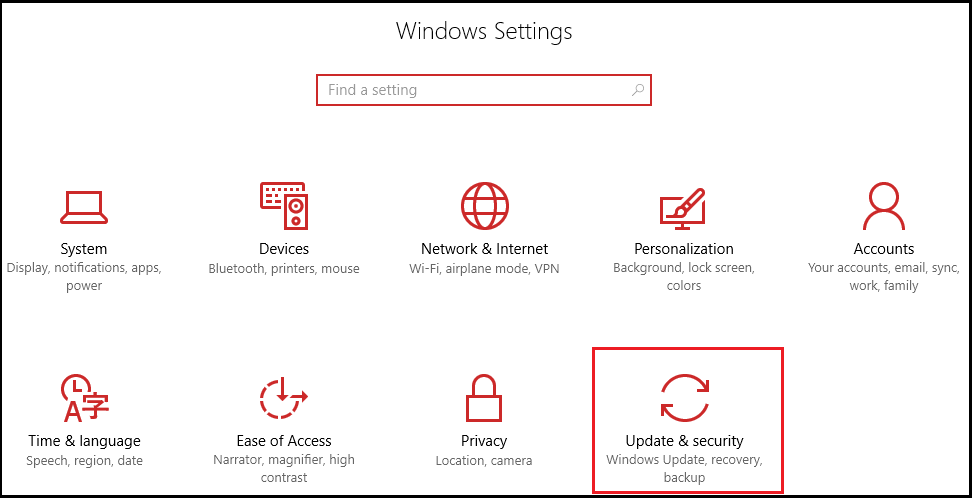
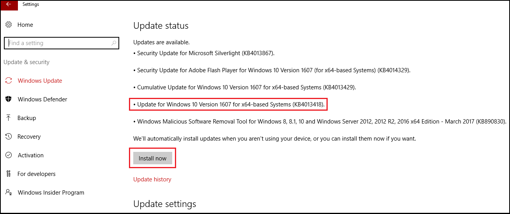

# Install Bash for Windows

## Updating to Windows 10 Anniversary Edition

1. From the Windows Run box, start the Windows Settings app.

1. Select **Update & security**.

	

1. Select **Check for updates**.

1. Once the update descriptions have been downloaded, the Windows 10 update will be listed as build 1607 (or later). Select **Install now**.

	
 

## Installation steps
