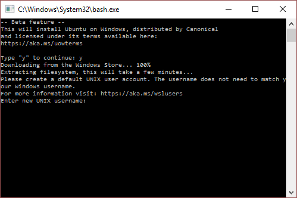
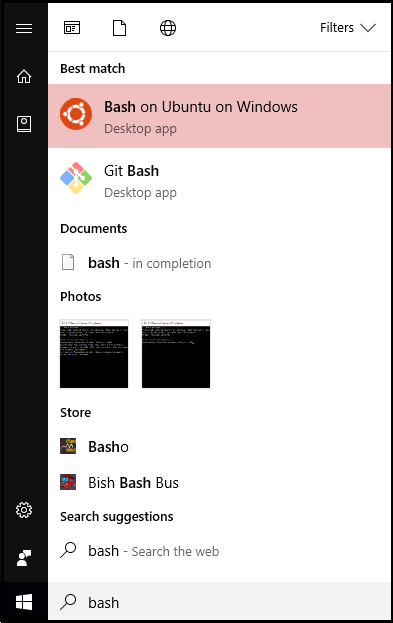

# Install Bash for Windows 10 Anniversary Update

## Update your computer to Windows 10 Anniversary Update

The following steps walk you through installing the Windows 10 Anniversary Update on your computer using Windows Update:

1. From the Windows Run box, start the Windows Settings app.

1. Select **Update & security**.

	

1. Select **Check for updates**.

1. Once the update descriptions have been downloaded, the Windows 10 update will be listed as build 1607 (or later). Select **Install now**.

	

	Once you select **Install now**, a progress bar displays the current status of the update process.
 
## Install Bash for Windows 

The following steps walk you through installing the Bash environment from Windows 10 Anniversary Update:

1. From the Windows Run box, start the Windows Settings app.

1. Select **Update & security**.

	

1. In the left menu, select **For developers**.

1. Under **Use developer features**, select **Developer mode**.

	

1. On the **Use developer features** confirmation dialog, select **Yes**

	

1. Close the **Settings** application.

1. Open the **Control Panel**.

1. Select **Programs**.

	

1. Select **Turn Windows features on or off**.

	
 
1. Select **Windows Subsystem for Linux (Beta)**.

	

1. If prompted to reboot your computer, select **Restart now**.

1. After your computer reboots, and you log into Windows, open the Windows Run box, and type `bash.exe`. Select the **bash.exe** result.

	

1. In the command window (that displays when you select bash.exe), type `y` and press **Enter** to download and install Bash from the Windows Store.

	 

1. When you are prompted to create a default UNIX user account, enter a username in the required field, and press **Enter**. The account does not have to match your Windows account, and it can't be `admin`.

	

1. Enter (and confirm) a password for the username you entered.

1. Close the command prompt. Now, if you type `bash` into the Windows Run box, you'll see that it has been installed. As with any Windows desktop application, you can right-click it, and, from the context menu, pin the application icon to the Start menu or taskbar.   

	

## Next steps

- [Download and install Azure NuGet packages](packages.md)