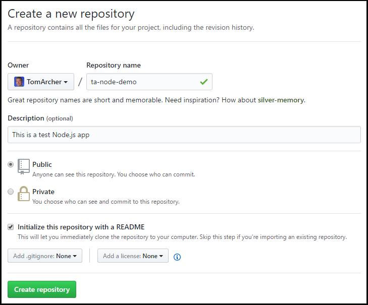

# Create a Node.js app (using GitHub and Yo)
This article illustrates how to create a GitHub repository, create a Node.js app using the yo generator, and store the new app's source code files in the GitHub repository. 

> [!NOTE]
> The sections in this article refer to an example Node app name of ``node-demo``. Wherever you see ``node-demo`` in the instructions, you'll need to substitute the name of your app.   
> 
> 

## Create a repository for your app in GitHub
This section walks you through creating a new GitHub repository for your app. 

1. In your browser, navigate to your GitHub profile.

1. Select **Repositories**.

	

1. Select **New**.

	

1. In the **Create a new repository** page:

	- **Repository name** - Enter the name of the new app.
	- **Description** - (Optional) Enter the description for the app.
	- **Public/Private** - Depending on your GitHub subscription type, select the appropriate visibility for your app.
	- ** Initialize this repository with a README** - Select this if you want GitHub to create a readme file for you.

	Select **Create repository**.

	 

1. Open a command prompt.

1. Create a new directory for your app. 

	```
	mkdir node-demo
	```

1. Change directories to the app directory.

	```
	cd node-demo
	```

1. Initialize the Git repository in the app directory.

	```
	git init
	```

1. Add a Git remote endpoint, replacing the &lt;GitHubUserName> and &lt;GitHubToken> placeholders with your GitHub values. You can locate your GitHub token via the GitHub site (in your profile's Settings page).   

	```
	git remote add origin https://<GitHubUserName>:<GitHubToken>@github.com/<GitHubUserName>/node-demo.git
	```

## Create a Node.js app using the yo generator
This section contains instructions for creating a Node.js app using the yo generator.

1. [Install Azure CLI 2.0](https://docs.microsoft.com/en-us/cli/azure/install-azure-cli).

1. In a command prompt, change directories to your app directory.

1. Run the yo generator.

	```
	yo express
	```

1. Select the following options when prompted by the yo generator:

    `? Would you like to create a new directory for your project?` **Yes**  
    `? Enter directory name` **{appname}**  
    `? Select a version to install:` **MVC**  
    `? Select a view engine to use:` **Jade**  
    `? Select a css preprocessor to use (Sass Requires Ruby):` **None**  
    `? Select a database to use:` **None**  
    `? Select a build tool to use:` **Grunt**

1. Start the app. 

	```
	npm start
	``` 

1. By default, the app will run on port 3000. In your browser, navigate to [http://localhost:3000](http://localhost:3000) to ensure that you can see that the app is running properly

	

1. Return to the command prompt, and click **&lt;Ctrl>&lt;C>** to stop the app.

## Push your app to GitHub
Once you've created and test your app, the following steps will push your app to GitHub.

1. In a command prompt, change directories to your app directory.

1. Add the app's files to the Git repo.

	```
	git add .
	```

1. Commit the app's files. 

	```
	git commit -m "initial checkin"
	```

1. Push your changes to the GitHub repository.

	```
	git push origin master
	```

## Next steps
- [Deploy an existing Node.js app to Azure App Service](deploy-node-app-to-azure.md)


