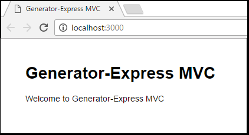

# Create a Node.js app (using GitHub and Yo)
This article illustrates how to create a GitHub repository, create a Node.js app using the yo generator, and store the new app's source code files in the GitHub repository. 

> [!NOTE]
> The sections in this article refer to an example Node app name of ``ta-node-demo``. Wherever you see ``ta-node-demo`` in the instructions, you'll need to substitute the name of your app.   
> 
> 

## Create a Node.js app using the yo generator
This section contains instructions for creating a Node.js app using the yo generator.

1. Open a command prompt.

1. Install yo.

	```
	npm install --global yo
	```

1. Install the Express generator for yo 
	
	```
	npm install -g generator-express
	```

1. Run the yo generator.

	```
	yo express
	```

1. Select the following options when prompted by the yo generator:

    `? Would you like to create a new directory for your project?` **Yes**  
    `? Enter directory name` **{appname}**  
    `? Select a version to install:` **MVC**  
    `? Select a view engine to use:` **Jade**  
    `? Select a css preprocessor to use (Sass Requires Ruby):` **None**  
    `? Select a database to use:` **None**  
    `? Select a build tool to use:` **Grunt**

1. Start the app. 

	```
	npm start
	``` 

1. By default, the app will run on port 3000. In your browser, navigate to [http://localhost:3000](http://localhost:3000) to ensure that you can see that the app is running properly

	

1. When finished, close the browser page/tab, return to the command prompt, and click **&lt;Ctrl>&lt;C>** to stop the app.

## Push your app to GitHub
Once you've created and test your app, the following steps will push your app's source code to GitHub.

1. In a command prompt, change directories to your app directory.

1. Add the app's files to the Git repo.

	```
	git add .
	```

1. Commit the app's files. 

	```
	git commit -m "initial checkin"
	```

1. Push your changes to the GitHub repository.

	```
	git push origin master
	```

## Next steps
- [Deploy an existing Node.js app to Azure App Service](deploy-node-app-to-azure.md)
