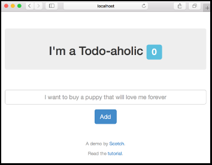

# Add DocumentDB to a Node.js app, and deploy to Azure

In this tutorial, you work with your own copy of a [todo app created and published by Scotch.io](https://scotch.io/tutorials/creating-a-single-page-todo-app-with-node-and-angular). The sections of this tutorial walk you through cloning the app to your local environment, running and debugging the app, adding DocumentDB support, and deploying to Azure App Service.

You can follow the steps below using a Windows, macOS, or Linux.  The entire tutorial should take only about 5 minutes to complete.

## Before you begin

In order to effectively run through this tutorial, you need to have the following software installed:

- [Visual Studio Code](https://code.visualstudio.com/) or [Visual Studio Code Insiders Build](https://code.visualstudio.com/insiders) - Either one will work for this tutorial. The main difference is that the Insiders Build provides access to the latest bug fixes and feature enhancements.  
- [Azure CLI 2.0](https://docs.microsoft.com/cli/azure/install-az-cli2)
- [Chrome](https://www.google.com/chrome/browser/desktop/) - Used for debugging the app's front-end
- Microsoft Azure account - If you don't have an account, you can [sign up for a free trial](http://go.microsoft.com/fwlink/?LinkId=623901) or [activate your Visual Studio subscriber benefits](http://go.microsoft.com/fwlink/?LinkId=623901).

## Download the sample

1. Open Visual Studio Code.

1. Press **&lt;F1>** to display the command palette.

	

1. Enter `gitcl` to find the `Git: Clone` command, and press **&lt;ENTER>**.

